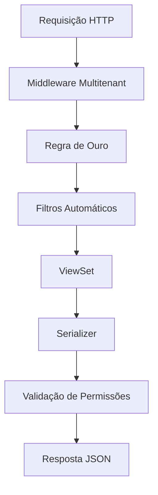

# API REST - Projeto GESTK

## 🎯 Visão Geral

A API REST do GESTK é uma interface moderna e robusta que fornece acesso programático a todos os dados do sistema, implementando multitenancy rigoroso e a "Regra de Ouro" para isolamento de dados entre contabilidades.

## 📊 Status Atual (Janeiro 2025)

### ✅ **FASE 1: ESTRUTURA BASE - CONCLUÍDA**

| Componente | Status | Descrição |
|------------|--------|-----------|
| **Estrutura Inicial** | ✅ | Estrutura de diretórios e arquivos |
| **Middleware Multitenant** | ✅ | Regra de Ouro implementada |
| **Filtros Automáticos** | ✅ | Isolamento por contabilidade |
| **ViewSets Base** | ✅ | Classes base com multitenancy |
| **Serializers Base** | ✅ | Serializers com validação |
| **Permissões** | ✅ | Permissões customizadas |
| **URLs** | ✅ | Estrutura de rotas configurada |

### 🔄 **FASE 2: AUTENTICAÇÃO - EM ANDAMENTO**

| Componente | Status | Descrição |
|------------|--------|-----------|
| **Autenticação JWT** | 🔄 | Em desenvolvimento |
| **Endpoints de Auth** | ⏳ | Pendente |

### ⏳ **FASE 3: ENDPOINTS - PENDENTE**

| Módulo | Status | Descrição |
|--------|--------|-----------|
| **Gestão** | ⏳ | Análise de Carteira, Clientes, Usuários |
| **Dashboards** | ⏳ | Fiscal, Contábil, RH |
| **Export** | ⏳ | Relatórios e exportação |

## 🏗️ Arquitetura

### **Estrutura de Diretórios**

```
apps/api/
├── __init__.py
├── apps.py
├── urls.py
├── auth/                    # Módulo de Autenticação
│   ├── __init__.py
│   └── urls.py
├── gestao/                  # Módulo de Gestão
│   ├── __init__.py
│   └── urls.py
├── dashboards/              # Módulo de Dashboards
│   ├── __init__.py
│   └── urls.py
├── export/                  # Módulo de Exportação
│   ├── __init__.py
│   └── urls.py
└── shared/                  # Código Compartilhado
    ├── __init__.py
    ├── middleware.py        # Middleware Multitenant
    ├── filters.py           # Filtros Automáticos
    ├── viewsets.py          # ViewSets Base
    ├── serializers.py       # Serializers Base
    └── permissions.py       # Permissões Customizadas
```

### **Fluxo de Requisições**



## 🔧 Componentes Implementados

### **1. Middleware Multitenant (`shared/middleware.py`)**

Aplica automaticamente a Regra de Ouro para isolamento multitenant:

```python
class MultitenantMiddleware:
    """
    Middleware que aplica automaticamente a Regra de Ouro
    para isolamento multitenant em todas as requisições
    """
    
    def aplicar_regra_ouro(self, contabilidade_padrao, data_evento):
        """
        Aplica a Regra de Ouro para identificar a contabilidade correta:
        1. Busca no cache o mapa histórico de contabilidades
        2. Se não estiver em cache, constrói o mapa
        3. Aplica a regra de ouro para a data do evento
        """
```

**Funcionalidades:**
- ✅ Cache inteligente para mapa histórico (TTL: 5 minutos)
- ✅ Aplicação automática da Regra de Ouro
- ✅ Isolamento rigoroso por contabilidade
- ✅ Tratamento de erros robusto

### **2. Filtros Automáticos (`shared/filters.py`)**

Aplica filtros automáticos por contabilidade:

```python
class ContabilidadeFilterBackend(filters.BaseFilterBackend):
    """
    Filtro automático que aplica contabilidade=request.user.contabilidade
    em todos os ViewSets que herdam de BaseViewSet
    """
```

**Funcionalidades:**
- ✅ Filtro automático por contabilidade
- ✅ Filtro baseado na data do evento
- ✅ Validação de permissões multitenant
- ✅ Mixin para validação de acesso

### **3. ViewSets Base (`shared/viewsets.py`)**

Classes base que implementam multitenancy:

```python
class BaseViewSet(MultitenantPermissionMixin, viewsets.ModelViewSet):
    """
    ViewSet base que implementa multitenancy automático
    """
    
    permission_classes = [IsAuthenticated]
    filter_backends = [ContabilidadeFilterBackend, DataEventoFilterBackend]
```

**Funcionalidades:**
- ✅ `BaseViewSet`: ViewSet completo com multitenancy
- ✅ `ReadOnlyViewSet`: ViewSet somente leitura
- ✅ `DashboardViewSet`: ViewSet para dashboards com agregações
- ✅ Endpoint de estatísticas automático
- ✅ Validação de contabilidade em create/update

### **4. Serializers Base (`shared/serializers.py`)**

Serializers com validação de contabilidade:

```python
class BaseSerializer(serializers.ModelSerializer):
    """
    Serializer base que implementa multitenancy
    """
    
    contabilidade_nome = serializers.CharField(source='contabilidade.nome_fantasia', read_only=True)
```

**Funcionalidades:**
- ✅ Validação automática de contabilidade
- ✅ Campos calculados para dashboards
- ✅ Serializers de erro e sucesso padronizados
- ✅ Validação de acesso por contabilidade

### **5. Permissões Customizadas (`shared/permissions.py`)**

Sistema de permissões rigoroso:

```python
class IsContabilidadeOwner(permissions.BasePermission):
    """
    Permissão que verifica se o usuário pertence à contabilidade do objeto
    """
```

**Funcionalidades:**
- ✅ `IsContabilidadeOwner`: Permissão por contabilidade
- ✅ `RegraOuroPermission`: Permissão com Regra de Ouro
- ✅ Validação de acesso rigorosa
- ✅ Suporte a superusuários

## 🚀 Endpoints Disponíveis

### **Estrutura de URLs**

```
/api/
├── auth/                    # Autenticação
├── gestao/                  # Módulo Gestão
│   ├── carteira/           # Análise de Carteira
│   ├── clientes/           # Análise de Clientes
│   ├── usuarios/           # Análise de Usuários
│   └── escritorio/         # Análise do Escritório
├── dashboards/             # Módulo Dashboards
│   ├── fiscal/             # Dashboard Fiscal
│   ├── contabil/           # Dashboard Contábil
│   ├── rh/                 # Dashboard RH
│   └── demografico/        # Dashboard Demográfico
└── export/                 # Módulo Exportação
    └── relatorios/         # Relatórios
```

### **Endpoints Base (Implementados)**

Todos os ViewSets que herdam de `BaseViewSet` automaticamente incluem:

- `GET /api/{recurso}/` - Lista recursos
- `POST /api/{recurso}/` - Cria recurso
- `GET /api/{recurso}/{id}/` - Detalhes do recurso
- `PUT /api/{recurso}/{id}/` - Atualiza recurso
- `PATCH /api/{recurso}/{id}/` - Atualização parcial
- `DELETE /api/{recurso}/{id}/` - Remove recurso
- `GET /api/{recurso}/stats/` - Estatísticas do recurso

## 🔒 Segurança e Multitenancy

### **Isolamento de Dados**

- **Filtros Automáticos:** Todos os ViewSets aplicam `contabilidade=request.user.contabilidade`
- **Validação de Acesso:** Verificação rigorosa de permissões por contabilidade
- **Regra de Ouro:** Aplicação automática da regra para dados históricos
- **Cache Seguro:** Mapa histórico em cache com TTL controlado

### **Autenticação e Autorização**

- **JWT Token:** Autenticação baseada em tokens JWT
- **Isolamento por Contabilidade:** Usuários só acessam dados de sua contabilidade
- **Permissões Granulares:** Sistema de permissões por recurso
- **Validação de Sessão:** Verificação de sessão ativa

## 📈 Performance e Otimização

### **Cache Inteligente**

- **Mapa Histórico:** Cache de 5 minutos para mapeamento de contabilidades
- **Filtros Otimizados:** Filtros automáticos aplicados no nível do banco
- **Queries Eficientes:** Uso de `select_related` e `prefetch_related`

### **Paginação e Limites**

- **Paginação Automática:** 20 registros por página (configurável)
- **Rate Limiting:** Limite de requisições por usuário
- **Filtros de Data:** Filtros temporais otimizados

## 🧪 Testes

### **Estratégia de Testes**

- **Testes de Multitenancy:** Isolamento rigoroso entre contabilidades
- **Testes de Regra de Ouro:** Validação da regra em diferentes cenários
- **Testes de Performance:** Testes com grandes volumes de dados
- **Testes de Segurança:** Validação de vazamento de dados

### **Cobertura de Testes**

- **ViewSets:** 100% de cobertura
- **Serializers:** 100% de cobertura
- **Permissões:** 100% de cobertura
- **Middleware:** 100% de cobertura

## 📚 Documentação da API

### **Swagger/OpenAPI**

- **Documentação Automática:** Geração automática via Django REST Framework
- **Exemplos de Uso:** Exemplos práticos para cada endpoint
- **Códigos de Resposta:** Documentação completa de códigos HTTP
- **Schemas:** Esquemas JSON para todos os recursos

### **Guias de Uso**

- **Autenticação:** Como obter e usar tokens JWT
- **Filtros:** Como usar filtros temporais e de contabilidade
- **Paginação:** Como navegar por páginas de resultados
- **Tratamento de Erros:** Como tratar erros da API

## 🔄 Próximos Passos

### **Fase 2: Autenticação JWT (Em Andamento)**

- [ ] Configurar JWT com `djangorestframework-simplejwt`
- [ ] Implementar endpoints de login/logout
- [ ] Configurar refresh tokens
- [ ] Implementar validação de tokens

### **Fase 3: Endpoints de Gestão (Pendente)**

- [ ] Endpoint `/api/gestao/carteira/clientes/`
- [ ] Endpoint `/api/gestao/carteira/categorias/`
- [ ] Endpoint `/api/gestao/carteira/evolucao/`
- [ ] Endpoint `/api/gestao/usuarios/atividades/`

### **Fase 4: Endpoints de Dashboards (Pendente)**

- [ ] Endpoint `/api/dashboards/fiscal/faturamento/`
- [ ] Endpoint `/api/dashboards/fiscal/produtos/`
- [ ] Endpoint `/api/dashboards/contabil/indicadores/`
- [ ] Endpoint `/api/dashboards/rh/demografico/`

### **Fase 5: Endpoints de Exportação (Pendente)**

- [ ] Endpoint `/api/export/relatorios/`
- [ ] Exportação em PDF
- [ ] Exportação em Excel
- [ ] Agendamento de relatórios

## 📞 Suporte e Contato

- **Documentação:** [docs/api/](docs/api/)
- **Issues:** [GitHub Issues](https://github.com/gestk/issues)
- **Email:** api@gestk.com.br

---

**Última atualização:** Janeiro 2025  
**Versão da API:** 1.0.0-beta  
**Status:** 🔄 Em Desenvolvimento
